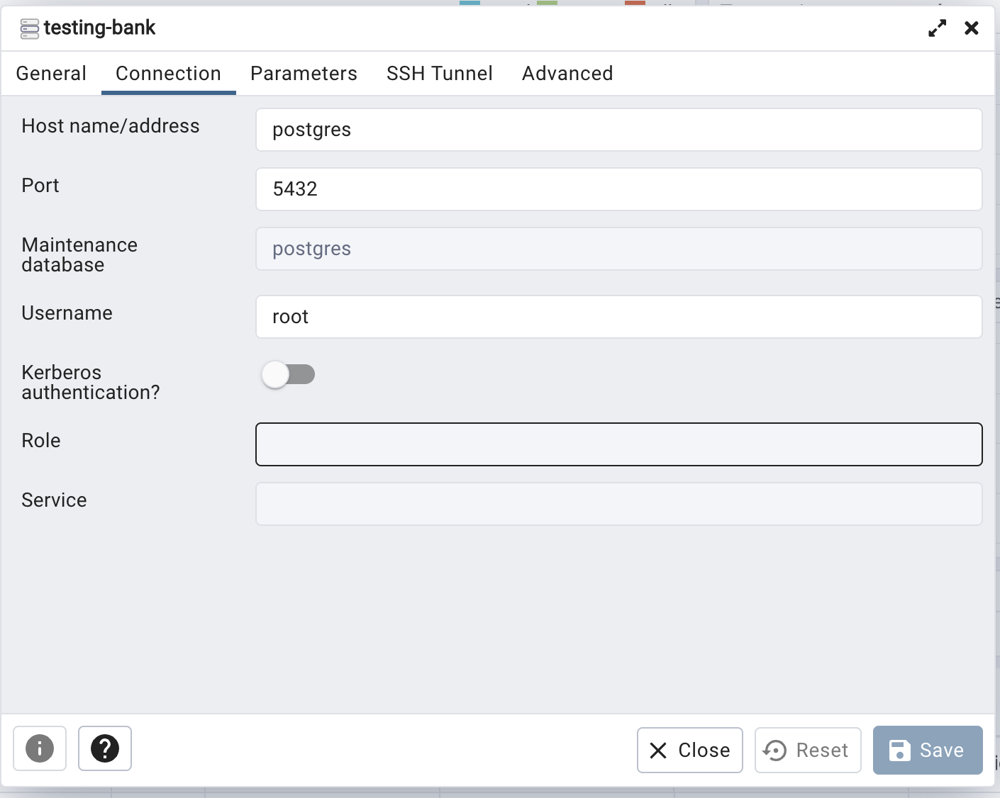

# Bank challenge

## Description

[Nest](https://github.com/nestjs/nest) framework TypeScript starter repository.

## Installation

```bash
yarn install --frozen-lockfile
```

## Running the app

```bash
# development
$ yarn run start

# watch mode
$ yarn run start:dev

# production mode
$ yarn run start:prod
```

## Test

```bash
# unit tests
$ yarn run test

# e2e tests
$ yarn run test:e2e

# test coverage
$ yarn run test:cov
```

## Run in docker-compose

```bash
docker-compose up
```

This will spin up the app in a docker container with a postgres server and a redis server.
Additionally it will give you a pgadmin to see the database.

To connect the pgadmin GUI to the postgres database add the following connection. The user/pass for the postgres server are in the secrets folder.


